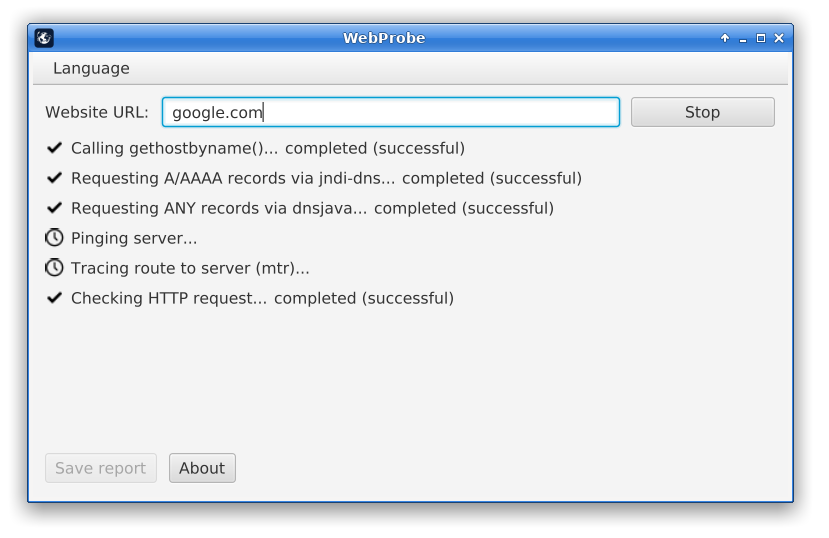

WebProbe is a website connectivity diagnostic tool. It helps you find out why a website is not working and generates a detailed report for each step of the connection process — including ping/traceroute to the server, DNS resolution, SSL/TLS handshake, and HTTP request validation.

Screenshot:

To download the application, visit the official website: https://pascalhp.net/webprobe/
